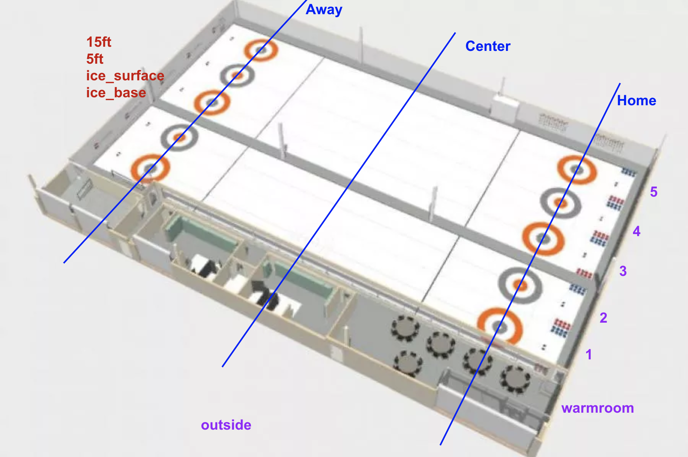

# curling-ice-sensors



## Installation

First Clone the repo on your Raspbery Pi and install python dependencies:

```shell script
pip install -r requirements.txt
```

The file `settings.ini` contains information about every thermal sensor. This is a globally shared file so it also includes sensors that are not connected to the device. The code will gather a list of all connected devices and then use the settings file as a lookup table for information about location X, Y, and Z.

```ini
[28-3c01b5562191]
loc_x = home
loc_y = 2
loc_z = ice_base
offset = 1.53

[28-3c01b55698c0]
loc_x = home
loc_y = 2
loc_z = ice_surface
offset = 0.93

[28-0301a2791250]
loc_x = home
loc_y = 3
loc_z = ice_base
offset = 1.11

...
```

### Create local.ini file

Copy the template and change the values for the DHT sensors.
```
$ cp local_template.ini local.ini
```
These values are unique per Raspberry Pi and thus cannot be part of the repo.


## Starting a service
The service file definition is `ice_sensors.service`. The following steps will create a systemd daemon.

1. Create `run_ice_sensors.sh` one directory outside of the repo.
2. 
You can get your Datadog key from the [Organisation Settings](https://app.datadoghq.com/organization-settings/api-keys) page.

```
#!/bin/bash

DATADOG_API_KEY=<your key here> python3  /home/pi/curling-ice-sensors/collect_measurements.py
```

2. Test the script
Make sure the bash script works by executing it directly from the cloned repo. You should see something like this:
```
$ ../run_ice_sensors.sh
Found file: /sys/bus/w1/devices/28-0301a27910af/w1_slave
Found file: /sys/bus/w1/devices/28-3c01b556cfa8/w1_slave
Found file: /sys/bus/w1/devices/28-3c01b55611c2/w1_slave
Found file: /sys/bus/w1/devices/28-0301a279a2cc/w1_slave
Found device: /sys/bus/w1/devices/28-0301a27910af/w1_slave FOUND
Found device: /sys/bus/w1/devices/28-3c01b556cfa8/w1_slave FOUND
Found device: /sys/bus/w1/devices/28-3c01b55611c2/w1_slave FOUND
Found device: /sys/bus/w1/devices/28-0301a279a2cc/w1_slave FOUND
Scanning /sys/bus/w1/devices/28-0301a27910af/w1_slave ...
Scanning /sys/bus/w1/devices/28-3c01b556cfa8/w1_slave ...
```

3. Run the installation script as sudo

```
$ sudo ./install.sh
```
This will create a systemd daemon that runs in the background and restarts itself. The configuration for this is defined in `ice_sensors.service`
